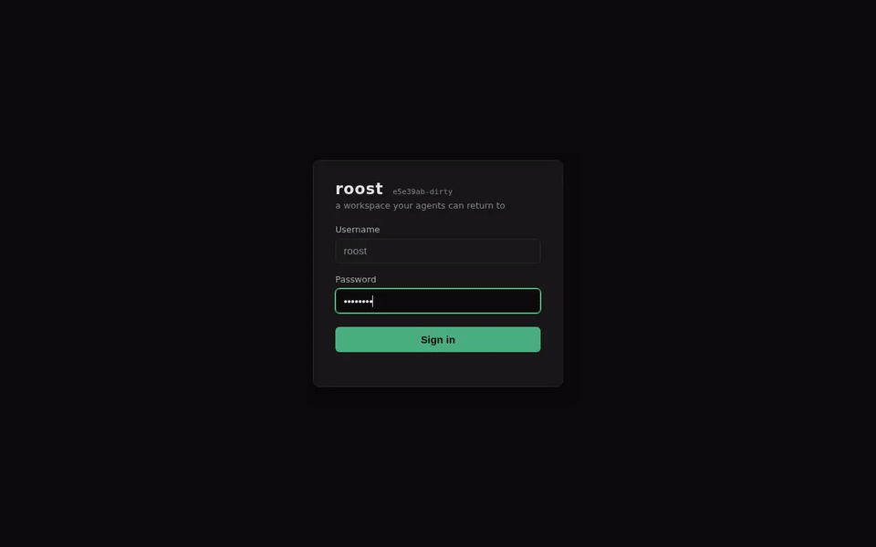
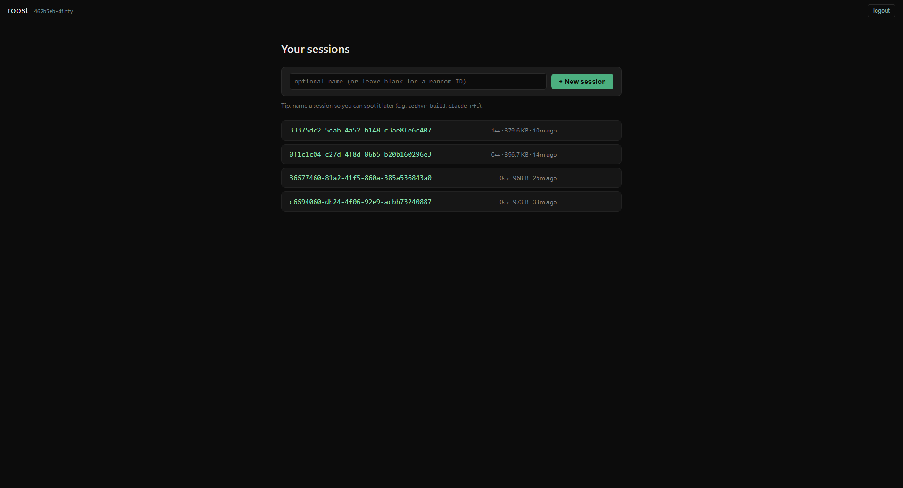
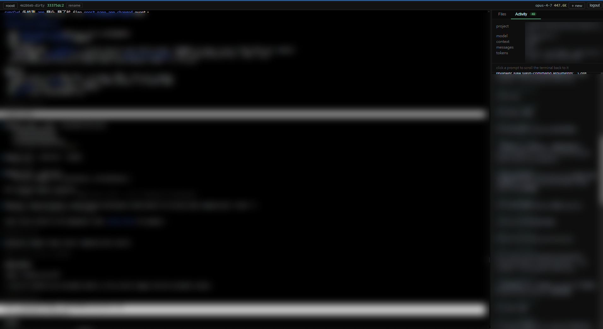
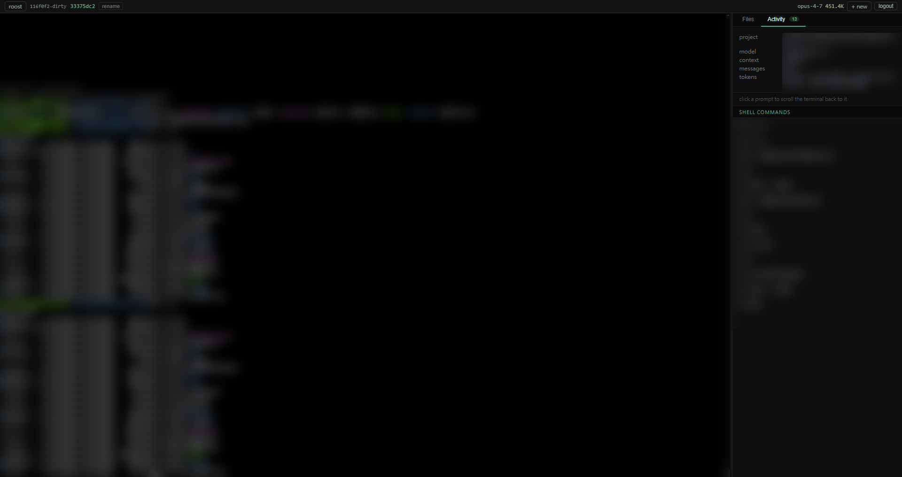

# roost

**A self-hosted browser workspace for terminal-first AI coding.**

Install one binary on your Linux dev box. SSH-tunnel it. Open a browser
from your laptop — Windows, macOS, any OS. You get a real terminal, a
file tree, and a panel that watches your Claude Code or Codex session —
all in one page, on every device you own.



> **Tested daily**: Windows browser → Linux server, SSH-tunneled. macOS
> as the *server* works but is rougher around the edges right now — fixes
> in progress.

- **Terminal that survives disconnects.** Backed by `tmux` under the hood,
  so closing your laptop, switching networks, or restarting the server
  doesn't kill your running build or your in-flight agent.
- **File tree next to the terminal.** Click to preview. Drag-drop or
  Ctrl+V from your OS to upload. Click a file to download.
- **Activity panel at a glance.** Live model name, latest context size,
  every prompt you've sent — click one to scroll the terminal back to it.
  Works with Claude Code and Codex.
- **Multi-session, multi-tab.** Each browser tab is its own named shell.
  Open two tabs on the same session to share the same screen with yourself.
- **No cloud. No subscription. No account.** One process, one user,
  one binary.

> Status: pre-1.0, single-user, designed for SSH-tunnel deployment.
> Token counts are surfaced; dollar amounts deliberately aren't (API rates
> shift, subscription plans bill differently — pair the numbers with your
> own price sheet).

---

## Contents

- [Quick start](#quick-start)
- [What you get](#what-you-get)
- [Configuration](#configuration)
- [Running as a service](#running-as-a-service)
- [Multi-user on one machine](#multi-user-on-one-machine)
- [Public access](#public-access)
- [Why this exists](#why-this-exists)
- [What roost isn't](#what-roost-isnt)

---

## Quick start

### Requirements

- **Server**: Linux with `tmux` ≥ 3.0 (`apt install tmux`). `roost`
  refuses to start without `tmux`. macOS is supported
  (`brew install tmux`) but is not the daily-tested combo — expect
  rougher edges.
- **Browser**: any modern browser. Daily-tested with Chrome on Windows
  and Chrome/Firefox on Linux.
- **Build**: Go 1.23+ if building from source. Prebuilt binaries on
  [Releases](https://github.com/liamsysmind/roost/releases).

### Install

**Prebuilt tarball** (Linux / macOS × amd64 / arm64) — grab from
[Releases](https://github.com/liamsysmind/roost/releases/latest):

```bash
curl -LO https://github.com/liamsysmind/roost/releases/latest/download/roost-v0.1.0-linux-amd64.tar.gz
tar -xzf roost-v0.1.0-linux-amd64.tar.gz
cd roost-v0.1.0-linux-amd64
sudo install -m 0755 roost /usr/local/bin/roost   # optional
```

**Or build from source:**

```bash
git clone https://github.com/liamsysmind/roost && cd roost
make                       # fetches vendored JS deps (first run) + builds ./roost
sudo make install          # installs /usr/local/bin/roost  (optional)
```

`make` auto-runs `scripts/fetch-vendor.sh` the first time to populate
`internal/server/web/vendor/` (xterm.js + addons, marked, highlight.js).
Those files are `.gitignore`'d, so a fresh clone needs them fetched before
the embedded web UI can render the terminal. Re-run `make vendor` after
bumping any pinned version in the script.

### One-time setup

```bash
roost setup
# (prompts for a password; writes ~/.config/roost/config.toml)
```

Or non-interactive:

```bash
echo 'your-password' | roost setup --password-stdin
```

`setup` picks a free port automatically (default 8080, falls back to 8081…
if taken) and writes the chosen address into the config along with a
bcrypt password hash and a hook secret.

### Run

```bash
roost serve
# → roost listening on http://127.0.0.1:8080
```

`roost` binds to loopback only. You reach it from your laptop with an
SSH tunnel:

```bash
ssh -L 8080:localhost:8080 user@your-dev-box
```

Open <http://localhost:8080> in your browser, sign in with the password
you set. Done.

---

## What you get

### Sessions

The home page is a session picker. Type a memorable name (or leave blank
for a random ID) and hit **+ New session** to launch a fresh tmux-backed
shell. Each session is a separate URL like `/s/zephyr-build`, so:

- closing the tab doesn't kill the shell
- coming back to the URL re-attaches you to the same screen
- you can rename or delete sessions from the home list
- two tabs on the same URL get the **same** live view — useful for
  showing the screen to a colleague over a screenshare



### Terminal

A full xterm.js terminal with WebGL rendering, a 100K-line in-browser
scrollback buffer, and an effectively unbounded on-disk session log
that's replayed when you reattach — closing your laptop and coming back
the next morning still shows the conversation.

Scrollback navigation that works the way you'd expect:

- **Mouse wheel** scrolls the buffer, even while a TUI-style agent
  (Claude Code, Codex) is running. Hold **Shift** while wheeling to
  forward to the app instead (for `less`-style use).
- **Shift+PageUp / Shift+PageDown / Shift+Home / Shift+End** for
  keyboard navigation.

Copy / paste:

- `Ctrl+C` copies the selection — or sends `SIGINT` if nothing is selected
- `Ctrl+Shift+C` always copies
- `Ctrl+Shift+V` pastes from clipboard into the shell

### File panel

Right side of the page. Two tabs:

- **Files** — browse, preview, upload, download, rename, delete.
  Click a file for inline preview: markdown renders to HTML with code
  highlighting, source files get syntax highlighting (Go, Python, Rust,
  JS/TS, shell, YAML/TOML, etc.), images / video / audio / PDF render
  natively, anything else falls back to a plain-text block. The tree
  follows the terminal's `cd` automatically. Drag-drop anywhere on the
  page or **Ctrl+V** from your OS to upload — uploads stream straight
  to disk with no `/tmp` buffering and no upload-size cap.

- **Activity** — clickable history of what happened in this pane. Each
  item is an anchor — click to scroll the terminal back to where it
  ran, with the matched row briefly highlighted.

  Two sources of anchors:
  - **AI prompts** from Claude Code and Codex, pulled from each tool's
    on-disk session log. Only shown when roost detects that the agent
    is actually running in this pane (not just when a stale JSONL
    happens to share the cwd).
  - **Shell commands** scanned out of the terminal scrollback by
    matching the typical `user@host:path$ command` prompt pattern.

  Top-bar chips show the current AI session's model and latest
  context-token count; click either to open the panel directly. Anchor
  clicks pause themselves while a TUI app (vim, less, htop, …) owns
  the buffer.





### Notifications

Browser push notifications via Server-Sent Events:

```bash
roost hook-info
```

…prints a ready-to-paste snippet for `~/.claude/settings.json`. Once
configured, Claude Code's `Stop` hook fires a notification to your
browser whenever an agent stops waiting for input — your laptop pings
even when the roost tab is backgrounded. Chrome, Edge, and Firefox
all surface it as a normal OS notification after one prompt to grant
the permission.

---

## Configuration

`~/.config/roost/config.toml`:

```toml
[auth]
password_hash = "..."         # bcrypt; rewrite via `roost setup --force`
hook_secret   = "..."         # required header on POST /api/notify

[server]
addr = "127.0.0.1:8080"       # bind here; SSH tunnel into it

[session]
log_dir   = ""                # default: $XDG_DATA_HOME/roost/sessions
                              #   or ~/.local/share/roost/sessions
replay_kb = 4096              # how many KB of the log to send on attach.
                              #   0 = full log (effectively unbounded)
idle_ttl  = "24h"             # GC sessions with no clients after this idle.
                              #   tmux session survives even after GC.

[fs]
root = ""                     # default: your home directory.
                              #   /api/fs/* operations are contained here.
```

---

## Running as a service

### Linux (systemd user unit)

```bash
mkdir -p ~/.config/systemd/user
cp dist/systemd/roost.service ~/.config/systemd/user/
systemctl --user daemon-reload
systemctl --user enable --now roost
```

The shipped unit assumes `roost` is installed at `/usr/local/bin/roost`
(via `sudo make install`). If you can't or don't want to use sudo,
symlink the binary into your home and override the unit:

```bash
mkdir -p ~/.local/bin ~/.config/systemd/user
ln -sf "$(pwd)/roost" ~/.local/bin/roost

cat > ~/.config/systemd/user/roost.service <<'EOF'
[Unit]
Description=roost — self-hosted workspace for AI agents
After=default.target

[Service]
Type=simple
ExecStart=%h/.local/bin/roost serve
Restart=on-failure
RestartSec=3s

[Install]
WantedBy=default.target
EOF

systemctl --user daemon-reload
systemctl --user enable --now roost
```

**Enable linger** so the service survives logout (this is the bit
most people miss — a user-mode systemd unit dies the moment your last
SSH session closes):

```bash
sudo loginctl enable-linger $USER
loginctl show-user $USER | grep Linger   # Linger=yes
```

After this, `roost` is up across reboots, regardless of whether
anyone is logged in.

Useful commands:

```bash
systemctl --user status roost            # current state
systemctl --user restart roost           # restart (e.g. after rebuilding)
journalctl --user -u roost -f            # tail the log
journalctl --user -u roost -n 100        # last 100 lines
```

### macOS (launchd)

```bash
cp dist/launchd/com.liamsysmind.roost.plist ~/Library/LaunchAgents/
launchctl load ~/Library/LaunchAgents/com.liamsysmind.roost.plist
```

---

## Multi-user on one machine

`roost` is deliberately single-user per instance. If two people share a
host, they each run their own `roost` on a different port — UNIX UIDs
do the isolation, the binary stays simple.

```
[ shared linux host ]

  alice (UID 1001)                         bob (UID 1002)
   ~/.config/roost/config.toml              ~/.config/roost/config.toml
   ~/.local/share/roost/sessions/           ~/.local/share/roost/sessions/
   roost serve --addr 127.0.0.1:8081        roost serve --addr 127.0.0.1:8082

   from her laptop:                         from his laptop:
   ssh -L 8081:localhost:8081 alice@host    ssh -L 8082:localhost:8082 bob@host
   open http://localhost:8081               open http://localhost:8082
```

Each `roost` runs as its own user, sees only its own home / `tmux` /
`~/.claude/`. No state crosses between them.

---

## Public access

For browsers that can't SSH-tunnel (phones, friends' machines), front
roost with a Cloudflare Tunnel + Access — public HTTPS URL, no open
ports on your host, SSO in front of the password. Full setup in
[docs/cloudflare.md](docs/cloudflare.md).

---

## Why this exists

Existing tools didn't fit:

- **Warp** — cloud subscription, not self-hosted.
- **Cursor / Windsurf** — IDE-centric, not terminal-first.
- **ttyd / gotty / Wetty** — terminal only, no file management,
  no AI awareness.
- **filebrowser** — file management only, no terminal.
- **Tabby / Wave** — desktop apps, native install per OS.
- **code-server** — VS Code in a browser; great, but VS Code-shaped.

`roost` is the missing intersection: terminal + file tree + AI panel,
self-hosted on your own machine, accessed through any browser.

### roost vs. code-server

[`code-server`] is the closest substitute and the one people most often
ask about. Both put a workspace in your browser. The shape is very
different:

|                          | code-server                           | roost                                                                                |
|--------------------------|---------------------------------------|--------------------------------------------------------------------------------------|
| Centre of the UI         | VS Code editor                        | the terminal                                                                         |
| File editing             | Full VS Code editor + extensions      | None — edit inside the terminal with `vim`, `nano`, your usual tools                 |
| Terminal                 | Bottom panel, foldable                | The main surface                                                                     |
| AI integration           | Copilot extension at the syntax layer | Activity panel that reads Claude Code / Codex session logs at the conversation layer |
| Session persistence      | Reattach on reload                    | `tmux`-backed; survives disconnects, network changes, server restarts                |
| Sharing a screen         | One workspace per server              | Multiple named sessions on URLs you can re-open from another device or tab           |
| Install footprint        | Node + bundled VS Code                | One Go binary                                                                        |

If you want VS Code in a browser, use code-server. If you want a
terminal-first workspace where the AI's conversation history is a
first-class thing you can scroll back to, that's the gap `roost` fills.

[`code-server`]: https://github.com/coder/code-server

---

## What roost isn't

- **Not multi-tenant — and never will be.** Two people = two instances.
  Multi-user accounting belongs in a deployment-layer hub, not in this
  codebase.
- **Not exposed to the internet by default.** Loopback only. Reach it
  via SSH tunnel, Tailscale, ZeroTier, WireGuard — your call.
- **Not an editor.** The file tree is for moving artifacts in and out.
  Edit files with whatever editor you run inside the terminal.
- **Not a Claude Code clone.** It surfaces what Claude Code (or Codex)
  already records on disk; it doesn't run the agent itself.
- **No usage cost in dollars.** API prices shift, subscription plans
  bill differently. Token counts are shown — interpret them with your
  own price sheet.

---

## Building binaries for other hosts

```bash
make cross                 # writes dist/roost-<version>-<os>-<arch>
```

Cross-compiles to linux/amd64, linux/arm64, darwin/amd64, darwin/arm64.

---

## Contributing

See [CONTRIBUTING.md](CONTRIBUTING.md) for the dev loop and code
conventions, and [CLAUDE.md](CLAUDE.md) for the architecture overview.

## Security

Found a security issue? Please follow [SECURITY.md](SECURITY.md) — don't
open a public issue.

## License

[MIT](LICENSE).
